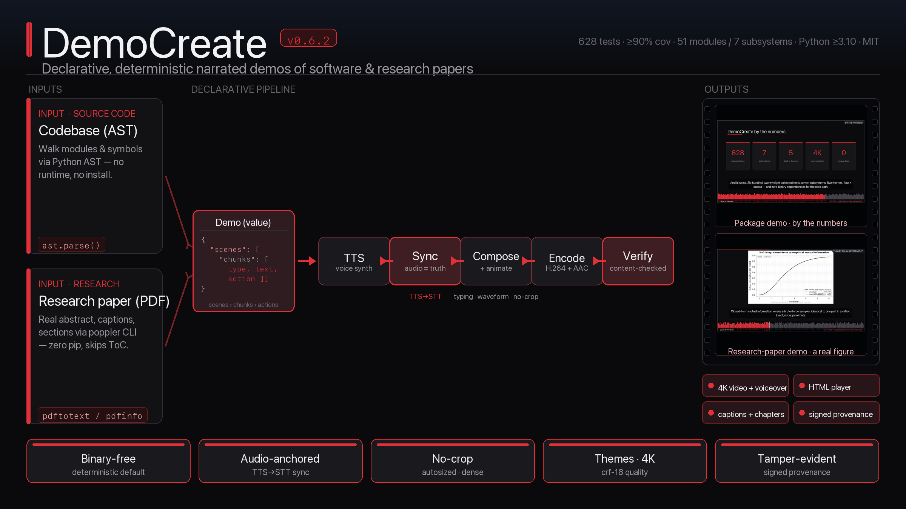
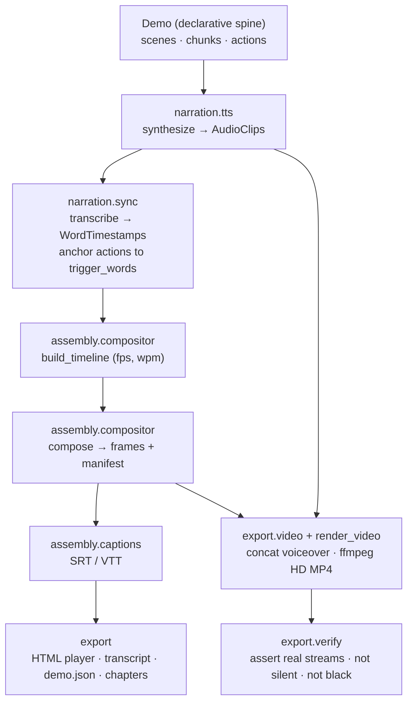

# DemoCreate

**Declarative, deterministic audio-visual demo generation for software packages
and research papers.**

DemoCreate (`democreate`) turns a single declarative `Demo` artifact — a
virtual-IDE action stream with narration chunks — into a narrated HD video:
a codebase tour, a website walkthrough, a terminal session, or a **research-paper
overview** (the PDF's figures and pages plus its associated codebase). Every heavy
backend (TTS, transcription, capture, animation, video assembly, PDF) sits behind
an abstract interface with a **pure-Python / system-binary deterministic default**,
so the package produces a real, inspectable demo with only light dependencies.
Optional extras and system binaries upgrade specific media surfaces; a wired
**Kokoro neural voice** (fully local) is available, while Whisper and Manim remain
guarded adapter slots. The look (themes, fonts, motion) and sound (voice, pacing,
normalization) are fully **configurable**.

- **Status:** alpha (`0.7.0`), Python ≥ 3.10, MIT licensed.
- **CI:** [](https://github.com/docxology/democreate/actions/workflows/ci.yml) — ruff + mypy + the full ≥90% coverage-gated suite on every push.
- **DOI (concept, resolves to latest):** [](https://doi.org/10.5281/zenodo.20693216)
- **Docs hub:** [`docs/`](docs/README.md) — architecture, schema, CLI, backends,
  testing, troubleshooting.



## Watch the demos

DemoCreate `v0.7.0` produces **real, content-verified videos** (H.264 +
AAC, with chapters, container metadata tags, and a signed steganographic
provenance poster) — in the **noir** aesthetic: near-black surfaces, bright
white text, and a single refined red as the only chroma.

The repository tracks exactly **one self-describing output bundle** — DemoCreate
explaining itself — checked in as the canonical, completely-working example:

- **The showcase** — `output/video/demo.mp4` (3840×2160 · ~156 s), plus its
  interactive player (`output/web/player.html`), YouTube chapters
  (`output/chapters/`), and a signed provenance poster (`output/provenance/`).
  Fifteen scenes — title card, graphical abstract, bullet slides, three typing
  code scenes, themes strip, a real paper figure, a describe-any-codebase
  (portfolio) slide, the architecture diagram, a stat-card slide, a terminal
  render+verify, and an outro — narrated by the **Kokoro** neural voice and
  compiled from one declarative file (`examples/democreate_showcase.json`, built
  by [`examples/make_showcase.py`](examples/make_showcase.py)).

Everything else under `output/` is gitignored and regeneratable from its
declarative source — including the **research-paper demo** (*Policy Entanglement
in Active Inference*, 1920×1080 · ~188 s), produced on demand with
`democreate paper` (see below). A test
([`tests/test_output_public_allowlist.py`](tests/test_output_public_allowlist.py))
gates the repo so only the self-descriptor bundle is ever committed. Full
write-up — paths, one-line regenerate commands, the 15 showcase scenes — in
[`docs/videos.md`](docs/videos.md).


*Package demo · the showcase — the "by the numbers" stat-card slide (689 tests · 8 subsystems · 5 themes · 4K · 0 binary deps), in the noir aesthetic.*


*Research-paper demo — a paper figure shown with its real caption.*

## Three load-bearing ideas

1. **Declarative spine.** All content is one `Demo` — an ordered stream of typed
   `Action`s plus narration `Chunk`s. Rendering is a pure function of it, so you
   edit the artifact and re-render rather than re-record. This merges
   **CodeVideo's** event-sourced virtual-IDE model with **VSpeak's**
   chunk/trigger narration model.
2. **Backends behind interfaces.** TTS, transcription, capture, animation, and
   assembly each sit behind an abstract base with a deterministic default. The
   adapter-backed media path uses a smoke-tested system voice, mss/Playwright,
   poppler, and ffmpeg when present; a wired Kokoro neural voice is an optional
   local upgrade, while Whisper / Manim surfaces remain guarded adapter slots. No
   heavy binaries (ffmpeg, torch, chrome) are required for the default
   HTML/transcript/manifest result.
3. **TTS → STT synchronization.** Narration audio is generated, then transcribed
   back to word-level timestamps; each on-screen action anchors to a spoken
   `trigger_word`. Real audio is the single source of timing truth.

## Install

Requires [uv](https://github.com/astral-sh/uv) and Python ≥ 3.10.

```bash
uv venv
source .venv/bin/activate
uv pip install -e ".[dev]"          # core + dev toolchain
```

Core dependencies are deliberately light: `pyyaml`, `typer`, `rich`, `jinja2`,
`pillow`. Optional extras upgrade individual subsystems (see the
[extras table](#extras)).

## Quickstart

```bash
democreate init demo.json           # write a starter demo artifact
democreate inspect demo.json        # validate + summarize it
democreate build demo.json -o output
open output/web/player.html         # the interactive HTML player
```

Tour a real repository:

```bash
democreate tour /path/to/repo --title "My Project Tour" -o output
```

As a library:

```python
from democreate import Demo
from democreate.pipeline import build_demo
from democreate.project_paths import Workspace

demo = Demo.from_json(open("demo.json").read())
result = build_demo(demo, Workspace("output"))
print(result.summary())             # scenes, chunks, actions, duration, player
```

Full walkthrough: [`docs/quickstart.md`](docs/quickstart.md).

## Make a real HD video (with voiceover)

The deterministic default build produces silent audio + synthetic frames + an HTML
player. To produce an actual **1080p MP4 with a real spoken voiceover**, use
`render` — which adds a smoke-tested **system voice** (macOS `say` / Linux
`espeak`, **zero pip installs**) and assembles the frames + voiceover into
H.264/AAC with `ffmpeg`:

```bash
democreate render demo.json -o output --voice Samantha   # → output/video/demo.mp4
democreate verify output/video/demo.mp4 --width 1920 --height 1080
```

**Want a better, fully-local AI voice?** Install the `tts` extra and fetch the
open-weight **Kokoro** neural model once, then render with it — markedly more
natural than the OS voice, still offline, no API key:

```bash
uv pip install -e ".[tts]" && democreate fetch-voice   # ~340 MB, one time
democreate render demo.json --tts kokoro --voice af_heart
```

`render` honours **audio as ground truth**: each frame is held on screen for the
*measured* duration of its narration clip, so video and voiceover share one
timebase by construction — no drift. The build then **content-verifies** the
result: it asserts a real video stream of the expected size, an audio stream
covering it, that the audio is **not silent** (mean volume above a floor), and that
a sampled frame is **not black** (pixel variance) — existence is never mistaken for
content.

By default the render is **animated** (`--animation-fps`, default 15): large
TrueType type at any resolution, a **moving speech waveform** with a sweeping
playhead locked to the audio, a progress bar, and scene chrome with section
labels. A scene can use a full-frame **background image** — a generated
architecture diagram (`animation.diagram`) or a **real browser screenshot** of the
HTML player — so the video can show genuine dashboards, not just synthetic panels.
Use `--no-animate` for a faster slideshow render.

Code scenes **type in character-by-character** with live pygments highlighting, an
**animated cursor** with click ripples brings UI scenes to life, and the MP4 gets
**embedded chapter markers** (plus a YouTube chapter file). Renders are
**themeable** across five presets (`--theme noir|dark|light|midnight|paper`, noir
is the default — near-black with a single red accent), come in any **aspect ratio**
(`--aspect 16:9|9:16|1:1`) and **resolution tier** (`--resolution 720p|1080p|1440p|2160p`,
up to 4K — everything scales to frame height), encode near-visually-lossless
(`crf 18`), and are fully configurable from a YAML file (`--config theme.yaml`):
colors, font scale, voice, pacing, loudness normalization, transitions, Ken Burns,
typing, and metadata. `democreate config` writes a fully-commented config to edit.
There are also `democreate thumbnail` (poster) and `democreate gif` (preview)
commands. See [`docs/config.md`](docs/config.md), [`docs/video.md`](docs/video.md),
and [`docs/recipes.md`](docs/recipes.md).

### Provenance, metadata & steganography

Every render can carry its own provenance three ways (`--author`, `--watermark`,
or the `metadata:` block in a config): **on-screen** top/bottom metadata bars
(author · source · running clock · watermark); **MP4 container tags**
(`title`/`artist`/`comment`, readable by players and `ffprobe`); and a
**steganographic** signed provenance payload (tool, version, author, and a
content hash) LSB-embedded into lossless poster + "transmission bookend" PNG
sidecars. The payload is *tamper-evident* — its content digest covers the stable
demo content and geometry, not render-state fields such as audio paths and
timestamps. For rendered outputs, verify against the resolved demo emitted at
`output/demos/demo.json`:

```bash
democreate stego output/provenance/poster_signed.png --demo output/demos/demo.json
```

(Honest note: LSB survives in the lossless PNG sidecars only; the H.264 video
carries the container tags instead.) See [`docs/provenance.md`](docs/provenance.md).

**Dogfooded:** DemoCreate's own intro video is itself a DemoCreate demo —
[`examples/make_assets.py`](examples/make_assets.py) generates the architecture
diagram + a real player screenshot, [`examples/make_intro_demo.py`](examples/make_intro_demo.py)
builds the artifact, then `democreate render examples/democreate_intro.json` produces a
~78s 1080p narrated walkthrough with pygments code, a moving waveform, scene
crossfades, and Ken Burns. See [`examples/README.md`](examples/README.md).

## Summarize a whole folder of projects

`democreate portfolio` turns a directory of repositories into a shelf of narrated
**software-describing** videos — one timestamped, content-verified MP4 per project:

```bash
democreate portfolio ~/code -o output --voice Samantha
# → output/<project>/video/<project>-summary-<UTC>.mp4  (one folder per project)
# → output/portfolio_index.json  +  output/portfolio_index.html  (a gallery)
```

Each summary is *describing*, not enumerating. From a first-principles read of what
makes a viewer understand software, it builds a fixed seven-beat arc regardless of
repo size: a **title** card, a **what-it-is** bullet slide pulled from the real
README, an **architecture** diagram of the project's real packages, a
**by-the-numbers** stat card (modules · lines · classes · functions), two or three
of the most **load-bearing modules** shown as real typed source narrated from their
**real docstrings**, a **how-to-run** terminal scene, and an **outro**. Selection
and extraction — not a model and not a one-scene-per-module list — carry the
description, so the default needs no network and the generated demo is
byte-deterministic. A project that fails to render is recorded in the index and the
batch continues; one bad repo never aborts the run. Discovery is Python-AST +
README based; a non-Python repo still gets a README/stat summary (without code
scenes).

Because the narration is *extracted* from the repository, a summary is only as
informative as the project's own README and docstrings: content verification
asserts the video is **real** (non-silent, non-black streams at the expected
size), not that the narration is good. A repo with a thin README or undocumented
modules still renders a valid, verified video — just a thinner one.

For a single repository, `democreate tour REPO --render` closes the same loop —
generate the tour demo and render it straight to a verified MP4. See
[`docs/cli.md`](docs/cli.md).

## Localized videos — audio and subtitles in different languages

`democreate localize` renders a demo with **audio in one language and subtitles in
another** — English audio with Russian subtitles, or vice-versa — using a **local,
configurable** translator (an [`ollama`](https://ollama.com) server; no cloud, no
API key). The narration is translated to the audio language and synthesized (that
drives the timing); the subtitle track is translated separately against the same
timing, so the two languages stay in lock-step. The filename makes both explicit:

```bash
# English audio (Kokoro) + Russian subtitles (ollama)
democreate localize demo.json --audio-lang en --subtitle-lang ru --model lfm2.5
# → output/video/<stem>-audio_en-subs_ru.mp4  + a Russian .srt/.vtt sidecar

# a batch of language combinations in one run
democreate localize demo.json --pairs "en:ru,ru:en,en:es" --model lfm2.5
```

The default translator is a deterministic no-op (renders the source language), so
the path is import-safe and offline-testable; `--translator ollama` localizes for
real. Subtitles work for any language (text only); *audio* in a language needs a
TTS voice for it — Kokoro's languages or an installed system voice (so Russian
*audio* needs a Russian voice present). See [`docs/cli.md`](docs/cli.md).

## Demo a research paper (PDF + codebase)

Point `democreate paper` at a PDF and (optionally) its codebase to get a narrated
overview — the title and abstract, the paper's figures and rendered pages, and an
architecture diagram of the code:

```bash
democreate paper paper.pdf --repo ./src --figures ./figures --theme paper -o output
```

The narration is built from the paper's **real content**: a correct abstract
(the extractor skips the table of contents), the **actual figure captions**
(`Figure N: …` parsed from the text), and the paper's **section structure**. PDF
ingestion uses the **poppler** command-line tools (`pdfinfo`/`pdftotext`/
`pdftoppm`) with **no pip dependency**; the optional `pdf` extra (pymupdf) adds
richer extraction. Worked example — the 170-page *Policy Entanglement in Active
Inference* paper (47 figures, 145-module codebase) renders to a verified
1080p video narrating its real abstract, figure captions, and 6 sections.
Details: [`docs/paper.md`](docs/paper.md).

## Architecture

A `Demo` (the declarative spine) threads through eight subsystems. The deterministic
defaults carry the core pipeline; system binaries and guarded adapter slots
upgrade specific media surfaces without changing the orchestration.



The spine (`schema.py`, `media.py`, `errors.py`, `project_paths.py`) is pure
Python with no I/O or heavy deps; `pipeline.py` and `cli.py` are thin
orchestrators. Details: [`docs/architecture.md`](docs/architecture.md).

## Subsystems

Each subsystem directory under `src/democreate/` carries its own `README.md`
(what it does) and `AGENTS.md` (rules for changing it).

| Subsystem | Owns | Deterministic default | Upgrade extra |
|-----------|------|-----------------------|---------------|
| `capture/` | Frame rendering; terminal/browser/input recording. | `SyntheticRenderer`, asciinema model, `NullBrowserDriver`, pure event log. | `capture`, `browser`, `replay` |
| `narration/` | Script generation, TTS, TTS→STT sync. | `TemplateScriptGenerator`, `SilentTTSBackend`, `HeuristicTranscriber`. `SystemTTSBackend` adds real OS voice with no pip deps. | `tts`, `whisper` |
| `animation/` | Syntax-highlight frames, cursor-zoom math, manim specs. | `rich` highlighting, pure zoom math, JSON manim spec. | `animation` |
| `codebase/` | AST traversal, visualization, import graphs. | stdlib `ast`. | `codebase` |
| `assembly/` | Timeline, compositing, captions, effects. | `ManifestCompositor`, pure SRT/VTT/ASS, Pillow effects. | `video` |
| `export/` | Spine + frames + audio → deliverables. | Jinja2 HTML player, Pillow GIF, Markdown/JSON/chapters, pure WAV concat. Real HD MP4 assembly + content verifier when `ffmpeg` is present. | `video` |
| `paper/` | Research-paper ingestion (PDF + figures → demo). | poppler CLI (`pdfinfo`/`pdftotext`/`pdftoppm`), `build_paper_demo`. | `pdf` |
| `translation/` | Localize: audio in one language, subtitles in another. | `IdentityTranslator` (no-op). `OllamaTranslator` adds local translation (a running `ollama` server, no pip dep). | — (local `ollama`) |

Spine modules: `schema.py` (the model), `media.py` (`AudioClip` / `FrameState`),
`config.py` (`Theme` / `AudioConfig` / `VideoConfig` / `RenderConfig`),
`pipeline.py` (orchestrator), `cli.py` (the `democreate` command). The renderer
(`capture/screen.py`) uses scaled TrueType fonts + **pygments** highlighting +
themes; the animator (`assembly/animator.py`) adds the moving waveform, scene
transitions, and Ken Burns.

## Testing

No mocking framework (no `unittest.mock`/`MagicMock`), fully deterministic, real
temp files, ≥90% coverage on the pure core (enforced via `fail_under = 90`).
`monkeypatch` is used only to simulate an absent optional binary or force the
core-only fallback path — never to fake a deterministic backend's output (see
[`docs/testing_philosophy.md`](docs/testing_philosophy.md)). Heavy backends carry a `backend` pytest marker
and skip when absent; the default path asserts the `BackendUnavailableError`
contract instead.

```bash
.venv/bin/python -m pytest -q        # full suite
.venv/bin/python -m pytest --cov     # the ≥90% gate
ruff check . && mypy src             # lint + types
```

Details: [`docs/testing_philosophy.md`](docs/testing_philosophy.md).

## Extras

Each extra upgrades one subsystem from its deterministic default to a real
backend. Install only what you need.

| Extra | Upgrades | Dependencies | Install |
|-------|----------|--------------|---------|
| `tts` | Real narration | `kokoro-onnx`, `soundfile`, `numpy` | `uv pip install -e ".[tts]"` |
| `whisper` | Word-timestamp transcription | `openai-whisper` | `uv pip install -e ".[whisper]"` |
| `capture` | Real screen capture | `mss`, `numpy` | `uv pip install -e ".[capture]"` |
| `browser` | Website driving | `playwright` | `uv pip install -e ".[browser]"` |
| `animation` | Code animations | `manim` | `uv pip install -e ".[animation]"` |
| `replay` | Input record/replay | `pynput`, `pyautogui` | `uv pip install -e ".[replay]"` |
| `video` | Video assembly helpers (real MP4 still needs `ffmpeg` on `PATH`) | `moviepy`, `ffmpeg-python` | `uv pip install -e ".[video]"` |
| `codebase` | Multi-language analysis | `tree-sitter`, `tree-sitter-languages` | `uv pip install -e ".[codebase]"` |
| `pdf` | Richer PDF extraction (poppler CLI is the zero-pip default) | `pymupdf` | `uv pip install -e ".[pdf]"` |
| `all` | Everything | (all of the above) | `uv pip install -e ".[all]"` |
| `dev` | Test + lint toolchain | `pytest`, `pytest-cov`, `ruff`, `mypy` | `uv pip install -e ".[dev]"` |

Check what is active with `democreate backends`. Full table:
[`docs/backends.md`](docs/backends.md).

## Prior art

DemoCreate builds on a lineage of demo-generation and recording tools: CodeVideo,
VSpeak, [asciinema](https://asciinema.org/), termtosvg, Recordly,
code-video-generator, Code2Video, and Paper2Video. Its contribution is unifying
the event-sourced virtual-IDE model with the chunk/trigger narration model behind
a deterministic, backend-pluggable spine.

## Citation

Cite via the **concept DOI** (always resolves to the latest archived release):
[`10.5281/zenodo.20693216`](https://doi.org/10.5281/zenodo.20693216). The
version-specific archive DOI for `0.7.0` is minted on its Zenodo release.

```bibtex
@software{democreate,
  author  = {Friedman, Daniel Ari},
  title   = {DemoCreate: Declarative, Deterministic Audio-Visual Demo Generation},
  year    = {2026},
  url     = {https://github.com/docxology/democreate},
  version = {0.7.0},
  doi     = {10.5281/zenodo.20693216},
  license = {MIT}
}
```

## License

MIT — see [`LICENSE`](LICENSE).
