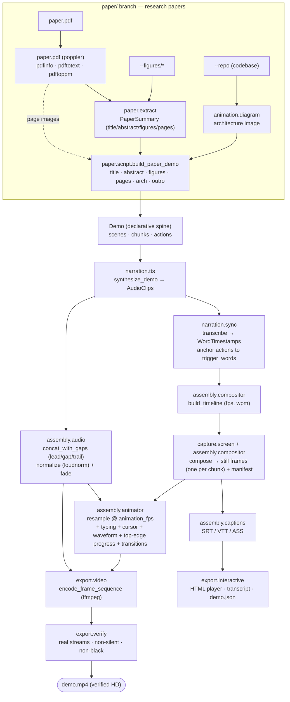

# Architecture

DemoCreate has one organizing idea: **a `Demo` is the single declarative source
of truth, and rendering is a pure function of it.** Everything else is a backend
that consumes the spine and writes artifacts into a `Workspace`.

## The spine

The spine is pure Python — no I/O, no heavy dependencies — and lives in a handful
of modules at the package root:

| Module | Role |
|--------|------|
| `schema.py` | The declarative model: `Demo` → `Scene` → `Chunk` → `Action`, the `ActionType` / `SceneKind` enums, and `WordTimestamp`. Lossless `dict`/JSON/YAML round-trip and `Demo.validate()`. |
| `media.py` | Shared media value types exchanged between subsystems: `AudioClip` (a rendered narration clip) and `FrameState` (a renderable snapshot of the virtual environment). |
| `errors.py` | The `DemoCreateError` hierarchy, including `BackendUnavailableError` (carries the extra to install), `SchemaValidationError`, `RenderError`, `SyncError`, `CaptureError`. |
| `project_paths.py` | `Workspace` — centralizes every output location (`demos/`, `audio/`, `frames/`, `video/`, `captions/`, `web/`, `manifests/`) so no module hardcodes a path. |
| `config.py` | `RenderConfig` (`Theme` + `AudioConfig` + `VideoConfig`) — the look/sound/motion settings, YAML-loadable, threaded through the pipeline. See [config.md](config.md). |
| `pipeline.py` | `Pipeline` / `build_demo` / `render_video` — the thin orchestrator that wires the subsystems in canonical order. |
| `portfolio.py` | `render_portfolio` / `render_project` / `collect_project_facts` / `discover_projects` — a thin orchestration sibling of `pipeline.py` that turns a directory of repositories into one timestamped, content-verified summary video per project. Builds each demo via `narration.project_summary.generate_project_summary_demo` (a deterministic README + AST "describing" generator) and renders it through `pipeline`. |
| `cli.py` | The `democreate` Typer app — a thin layer over `pipeline`, `portfolio`, and the subsystems. |

### The declarative model, in two lineages

- **CodeVideo's event-sourced virtual-IDE model.** A `Demo`'s content is an
  ordered stream of typed `Action`s mutating a virtual environment (editor,
  terminal, browser, camera). The same stream re-renders to any output format.
- **VSpeak's chunk/trigger model.** Narration is grouped into `Chunk`s, and each
  `Action` carries an optional `trigger_word` that anchors it to a spoken word so
  the sync engine can assign a millisecond timestamp from *real* TTS audio rather
  than guessing timing in advance.

The merge of these two is what makes DemoCreate's spine distinctive: content is
event-sourced (CodeVideo) *and* narration-anchored (VSpeak) in one artifact.

## The subsystems

Each subsystem directory carries its own `README.md` and `AGENTS.md`. Every heavy
capability has a pure-Python **deterministic default**; optional extras (or
zero-pip system binaries) upgrade it (see [backends.md](backends.md)).

| Subsystem | Owns | Default backend(s) | Upgrade |
|-----------|------|--------------------|---------|
| `capture/` | Frame rendering and recording terminal/browser/input sessions. | `SyntheticRenderer` (scaled TrueType fonts + pygments highlighting + themes), `NullBrowserDriver`, pure event model. | `capture`, `browser`, `replay` |
| `narration/` | Script generation, TTS, and TTS→STT sync. | `TemplateScriptGenerator`, `SilentTTSBackend` (and zero-pip `SystemTTSBackend`), `HeuristicTranscriber`. | `say`/`espeak` (OS), `tts`, `whisper` |
| `animation/` | Scaled fonts, speech waveform, architecture diagrams, manim specs. | `fonts.py`, `waveform.py`, `diagram.py`, JSON manim spec. | `animation` |
| `codebase/` | AST traversal, visualization, and import-dependency graphs. | stdlib `ast`. | `codebase` |
| `assembly/` | Timeline build, compositing, captions, audio assembly, timed-frame animation. | `ManifestCompositor`, pure SRT/VTT/ASS, `audio.py` (stdlib `wave` concat), `animator.py`. | ffmpeg (audio/video), `video` |
| `export/` | Turn the spine + frames + audio into deliverables, then verify. | Jinja2 HTML player, Markdown/JSON/chapters, ffmpeg-argv builder. | ffmpeg/ffprobe (`video`) |
| `paper/` | Read a research-paper PDF and build a paper demo. | `pdf.py` (poppler CLI), `extract.py`, `script.py`. | poppler (`pdf`) |

The look (`Theme`), sound (`AudioConfig`), and motion (`VideoConfig`) of a render
are governed by a single `RenderConfig` (`config.py`), threaded through the
pipeline, renderer, and animator — see [config.md](config.md).

## Data flow

A build threads the `Demo` through every stage. The `Demo` is mutated in place
(audio paths, timestamps) and every artifact lands in the `Workspace`. The
`build` command stops at the HTML player; `render` (and `paper`) continue through
the animated render, encode, and content verification.

```
script? -> validate -> TTS -> TTS->STT sync -> timeline
        -> compose (frames + manifest) -> captions -> player/transcript/json
render: -> voiceover (gaps/normalize/fade) -> animate (waveform/transitions/kenburns)
        -> encode (ffmpeg) -> verify (real/non-silent/non-black)
```

The full pipeline, from the declarative spine to a verified video (`pipeline.py`,
`assembly/`, `export/`), plus the research-paper branch (`paper/`):



The paper branch produces a normal `Demo`, so it flows through the very same
TTS → sync → animate → encode → verify pipeline as a software demo — see
[paper.md](paper.md).

## Why TTS → STT, not timing-by-guess

Synthesizing narration first and then transcribing it back to word-level
timestamps means timing is derived from the *actual* audio that will play. An
`Action` anchored to a `trigger_word` lands exactly when that word is spoken,
across any TTS voice and pace. The deterministic default makes this loop run with
no heavy deps: `SilentTTSBackend` emits silent clips of the estimated duration,
and `HeuristicTranscriber` produces evenly-spaced word timestamps — so the whole
synchronization mechanism is exercised and testable before any external neural
TTS or STT adapter is used.

## Determinism as a design constraint

The default path has no RNG, no wall-clock, and no network. A given `Demo`
renders byte-for-byte identically on every machine. That is what makes the demos
reproducible and what makes the test suite able to assert exact output rather than
loose tolerances. Guarded media backends may trade that exactness for fidelity,
and live behind `# pragma: no cover` adapters so they never compromise the core's
guarantees.
