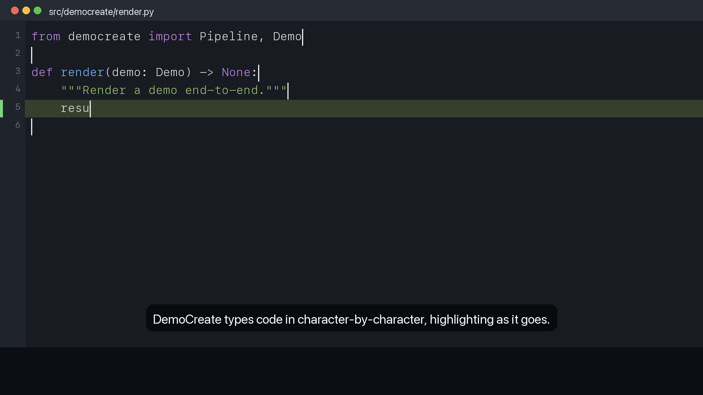
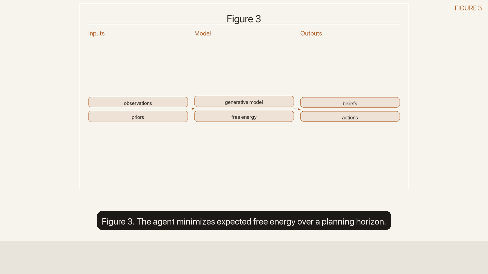
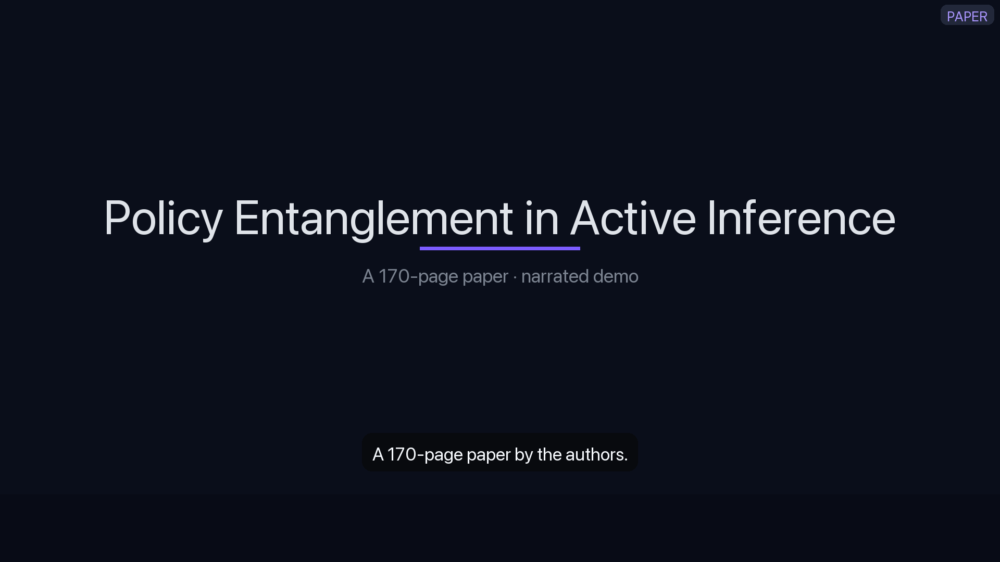
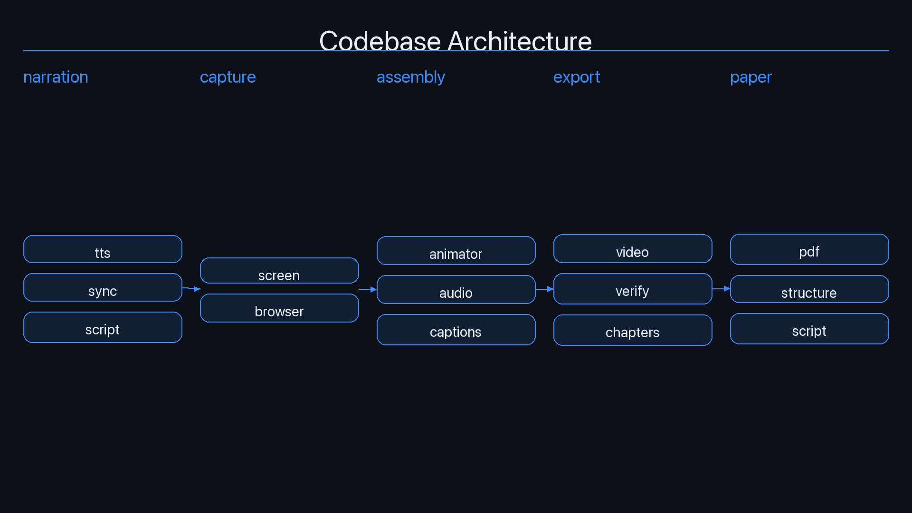
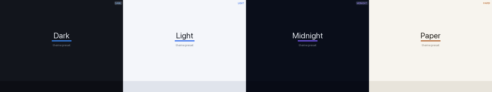

# Gallery

Every image below is a **real frame rendered by DemoCreate** — produced by the
package's own synthetic renderer
([`democreate.capture.screen.render_frame`](api.md#democreatecapturescreen)) and
its architecture-diagram renderer, not a screenshot or a mockup. They are
regenerated from source by [`_gallery/make_gallery.py`](_gallery/make_gallery.py):

```bash
.venv/bin/python docs/_gallery/make_gallery.py
```

The script is deterministic, so the gallery is reproducible from the current
code — exactly the property the whole package is built on.

## Typing animation (editor frame, mid-type)

A `codebase` (editor) frame caught partway through DemoCreate's
character-by-character typing animation: the code is revealed up to the current
`cursor_typed`, pygments highlights it as it appears, the active line is
band-highlighted, and the animated caret marks the cursor. In a render this is
re-rendered per output frame at an increasing `cursor_typed` so the code types
itself in. See [video.md](video.md#typing-animation).



## Research-paper figure scene (paper theme)

A figure scene from a research-paper demo, on the warm `paper` theme: a
full-frame figure background fit **whole** into the frame (contain, never
cropped) with the **real figure caption** narrated beneath it (`"Figure 3. ..."`,
extracted from the PDF, not a generic placeholder). Ken Burns is off by default so
the figure keeps its edges; see [paper.md](paper.md).



## Title slide (midnight theme)

A title slide on the high-contrast `midnight` theme: a word-wrapped headline, a
dimmed subtitle, and a section label in the top chrome — the opening card of a
paper or codebase demo.



## Architecture diagram

The left-to-right codebase architecture diagram
([`animation/diagram.py`](api.md#democreateanimationdiagram)) that a paper demo
embeds when given a `--repo`: columns grouped by top-level package, each a stack
of labeled module boxes with connectors. Carried as a full-frame
`background_image`, fit whole (contain) into the frame.



## Theme strip — four of the five presets

The same slide rendered across four preset themes — `dark`, `light`, `midnight`,
`paper` — selectable with `--theme` (or pinned in a `--config` YAML). The fifth
preset, **noir** (the package-wide *default*: near-black surfaces, white text, a
single red accent), is not in this strip; see it in [videos.md](videos.md) and
[config.md](config.md#theme-presets), which lists all five.



## See also

- [recipes.md](recipes.md) — the commands that produce videos like these.
- [video.md](video.md) — typing animation, cursor, waveform, no-crop layout, Ken Burns (off by default).
- [config.md](config.md) — themes and aspect ratios.
- [paper.md](paper.md) — how a paper becomes narrated figure/section scenes.
