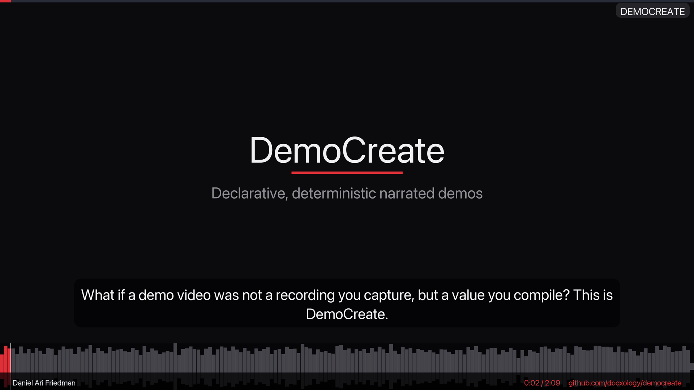
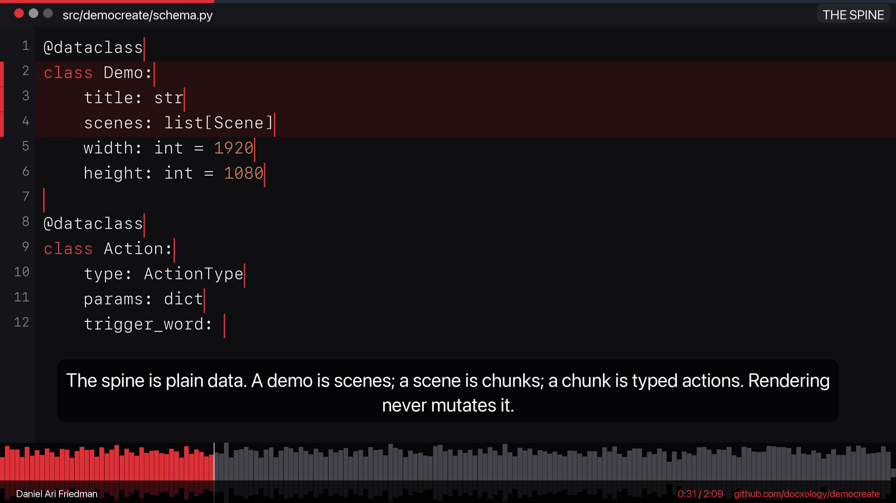
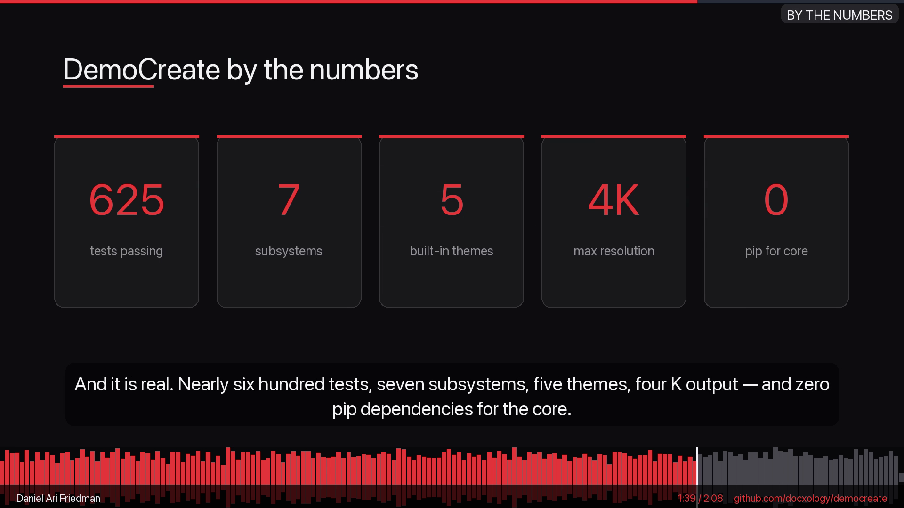
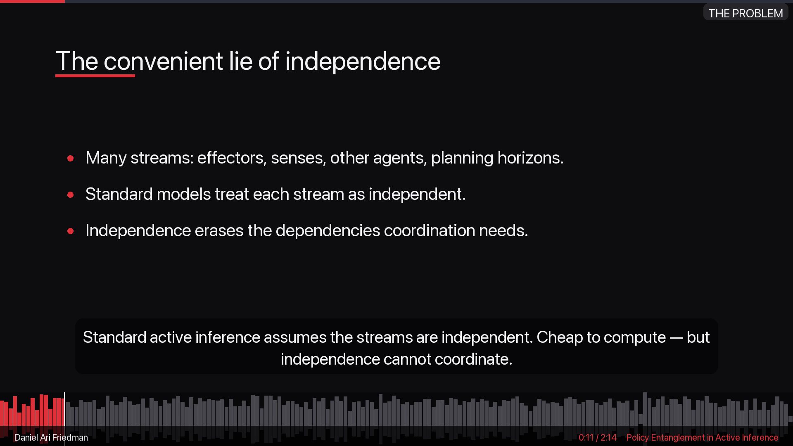
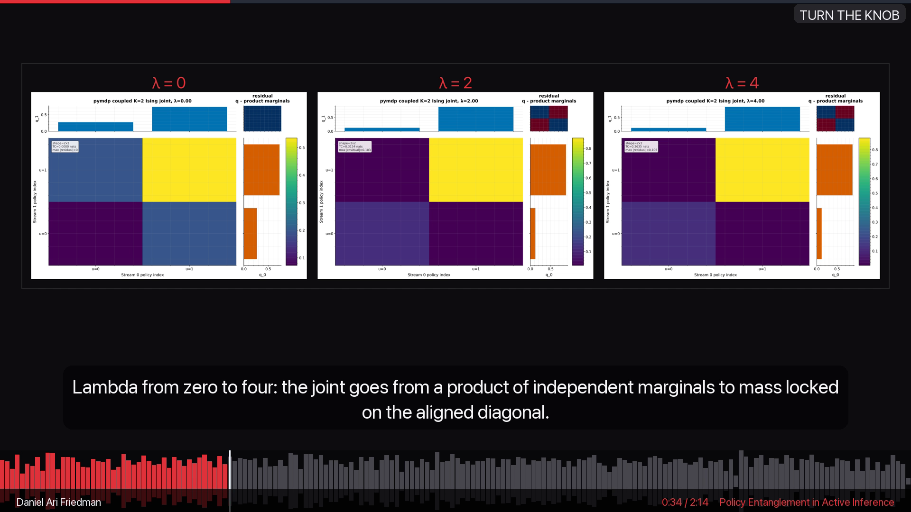
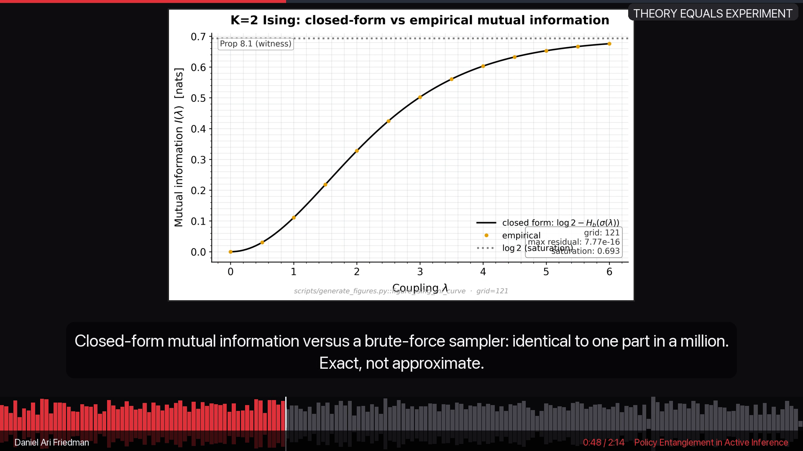

# The Produced Videos

DemoCreate `v0.7.0` produces **real, content-verified videos** — both
re-rendered in the **noir** aesthetic (near-black surfaces, bright-white text,
and a single refined red as the only chroma). The canonical package showcase is
now a **3840×2160 H.264 + AAC** render, while the paper demos remain **1920×1080
H.264 + AAC**. All carry **embedded chapter markers**, **MP4 container metadata
tags** (readable by `ffprobe` and players), and ship with a **signed,
tamper-evident steganographic provenance poster**. Each is content-verified at
render time: a real video stream of the expected size, a non-silent audio stream
(48 kHz) covering it, and non-black sampled frames.

> **Note:** `output/` is **gitignored** — the videos are regeneratable from the
> demo artifacts and the commands below. The real stills embedded on this page
> live (committed) under [`_videoframes/`](_videoframes/).

---

## Video 1 — Package Demo · The Showcase (the canonical demo)

DemoCreate's **definitive showcase** is itself a DemoCreate demo — the package
dogfooding its own pipeline through *every* renderable surface. It is the
canonical package demo: one declarative file (`examples/democreate_showcase.json`,
authored by [`examples/make_showcase.py`](../examples/make_showcase.py)) compiled
into a narrated 4K walkthrough that touches all 14 scene types the renderer
supports, including the **bullet slides** and **stat-card slides**, now re-rendered
in the **noir** look.

- **Path:** `output/video/demo.mp4`
- **Size / duration:** 3840×2160 · 129.7 s
- **Resolution / codecs:** 3840×2160 · H.264 + AAC (48 kHz)
- **Chapters:** 14 embedded chapter markers (one per scene)
- **Container tags:** `title="DemoCreate — The Showcase"`,
  `artist="Daniel Ari Friedman"`
- **Provenance:** signed steganographic poster that verifies; watermark
  `github.com/docxology/democreate`

**Regenerate (one line):**

```bash
uv run democreate render examples/democreate_showcase.json -o output \
  --voice Samantha --resolution 2160p --author "Daniel Ari Friedman" \
  --watermark "github.com/docxology/democreate"
```

> Build the declarative artifact first with
> [`examples/make_showcase.py`](../examples/make_showcase.py) (it writes
> `examples/democreate_showcase.json`). The render defaults to the **noir** theme.

**The 14 scenes — every renderable surface:**

1. **Hero title card** — the opening slide.
2. **Graphical abstract** — the one-glance overview figure, fit *whole* into the
   frame.
3. **Bullet slide** — *"A demo is a value, not a recording"* (the new
   `FrameState.bullets` surface).
4. **Code scene** — `schema.py`, the declarative spine, typing in
   character-by-character with live pygments highlighting.
5. **Code scene** — `tts.py`, the deterministic backends.
6. **Code scene** — `sync.py`, audio-as-ground-truth synchronization.
7. **Bullet slide** — a meta *"What you are seeing"* explainer.
8. **Themes strip** — the five preset themes side by side (noir is the default).
9. **Research-paper figure** — a real published figure, fit-contained (whole).
10. **Architecture diagram** — the pipeline.
11. **Stat-card slide** — *"by the numbers"* (664 tests · 7 subsystems · 5 themes
    · 4K · 0 binary deps), the `FrameState.stats` surface.
12. **Bullet slide** — the provenance story.
13. **Terminal scene** — a build + render + verify session.
14. **Outro** — the closing card.

Every scene is **no-crop**: figures fit whole, code autosizes, Ken Burns is off,
and the **progress line now sits at the absolute top edge** (`y=0`) so it never
clips the top of a figure or diagram. A **moving speech waveform** (played in red)
with an audio-locked playhead and a **bottom metadata bar** (author · running
clock · watermark) run throughout.

**Surfaces shown here:** bullet slides (`FrameState.bullets`, set via
`scene.context["bullets"]`) and stat-card slides (`FrameState.stats`, set via
`scene.context["stats"]`).

**Companion artifacts:**

- `output/web/player.html` — interactive HTML player
- `output/provenance/poster_signed.png` — signed provenance poster
- `output/provenance/provenance.json` — provenance payload
- `output/chapters/youtube_chapters.txt` — YouTube chapter file (14 chapters)
- `output/captions/captions.srt` — subtitles


*Video 1 — the opening title card; a refreshed still lifted from the encoded 4K noir render and downscaled for documentation.*


*Video 1 — a code scene typing in character-by-character with live pygments highlighting (noir: monochrome with red keywords), lifted from the encoded 4K render.*


*Video 1 — the "by the numbers" stat-card slide (664 tests · 7 subsystems · 5 themes · 4K · 0 binary deps), the `FrameState.stats` surface, lifted from the encoded 4K noir render.*

> The earlier intro demo (`examples/democreate_intro.json`, 78 s) still renders,
> but the showcase **supersedes it** as the canonical package demo — see
> [`examples/README.md`](../examples/README.md).

---

## Video 2 — Research-Paper Demo (Policy Entanglement in Active Inference)

A **curated, interpretive** tour of one real paper — hand-authored in
[`examples/make_paper_showcase.py`](../examples/make_paper_showcase.py). Rather
than reading the paper's literal figure captions, it explains what each figure
*means in the bigger picture*, building a narrative arc (the problem → one knob,
`λ` → validation → economics → geometry → structure → scale). The narration is
**concise and show-don't-tell**: framing devices are cut, each line states a
concrete mechanism or number, and a built **λ-sweep montage** *shows* the
independent → entangled transition instead of describing it.

- **Path:** `output/paper_showcase/video/demo.mp4`
- **Size / duration:** 1920×1080 · ~168 s (16 scenes)
- **Resolution / codecs:** 1920×1080 · H.264 + AAC (48 kHz)
- **Theme:** **noir** (black / white / red)

> **Two paper demos, two paths.** This *curated, interpretive* showcase (16
> scenes, hand-authored in `make_paper_showcase.py`) renders to
> `output/paper_showcase/`. The manuscript's evaluation instead reports the
> **template** `democreate paper <PDF>` render of the same paper —
> `output/paper_demo/`, 12 scenes, 188.0 s, narrating the paper's *literal*
> abstract, figure captions, and 6 sections (the `democreate paper` command
> below).

**Regenerate (one line):**

```bash
democreate render examples/democreate_paper_showcase.json -o output/paper_showcase \
  --voice Daniel --author "Daniel Ari Friedman" \
  --watermark "Policy Entanglement in Active Inference"
```

> For a **template-generated** demo of *any* paper (literal-caption narration),
> use `democreate paper <PDF> --repo <src> --figures <figs> --theme noir` — the
> author is auto-set from the PDF metadata. The showcase above is the curated,
> hand-narrated counterpart.

**What it shows (noir):**

- A **dynamic opening** — a hook, *the problem* and *the idea* as bullet slides,
  and a stat board — instead of a single static "Abstract" read
- A **λ-sweep montage** ("Turn the knob"): the paper's own `pymdp` joint
  posteriors at `λ = 0, 2, 4` laid side by side, so the product-of-marginals →
  locked-diagonal transition is *visible at a glance*
- A **figure tour** with **interpretive** narration: nine of the paper's own
  reproducible figures (shown whole, never cropped) framed by *what each means*
- A **codebase-architecture diagram** and a "bigger picture" outro
- The chapter titles themselves narrate the argument: *The convenient lie of
  independence → One knob → Turn the knob → Hidden in the Joint → Theory Equals
  Experiment → Coordination on Demand → Has a Price → A Principled Path → It
  Collapses to a Few Modes → And It Scales → When to Act as One*

**Companion artifacts:**

- `output/paper_showcase/web/player.html` — interactive HTML player
- `output/paper_showcase/provenance/poster_signed.png` — signed provenance poster
- `output/paper_showcase/chapters/youtube_chapters.txt` — YouTube chapter file
- `examples/democreate_paper_showcase.json` — the curated demo artifact

**Container tags:** `title="Policy Entanglement in Active Inference — A Visual Tour"`,
`artist="Daniel Ari Friedman"`


*Video 2 — the dynamic opening: "The convenient lie of independence" as a bullet
slide (a refreshed noir still from `output/paper_demo/video/demo.mp4`), replacing
the old single static "Abstract" read.*


*Video 2 — the "Turn the knob" λ-sweep: the paper's own `pymdp` joint posteriors
at `λ = 0, 2, 4` side by side, **showing** the product-of-marginals → locked-
diagonal transition instead of describing it.*


*Video 2 — a figure with **concise, interpretive** narration ("Closed-form mutual
information versus a brute-force sampler: identical to one part in a million.
Exact, not approximate."), not the literal caption, in the noir look.*

---

## Regenerate both

`output/` is **gitignored** — both videos are regeneratable artifacts. Re-run the
two commands to reproduce them:

```bash
# Video 1 — package demo · the showcase (canonical)
uv run democreate render examples/democreate_showcase.json -o output \
  --voice Samantha --resolution 2160p --author "Daniel Ari Friedman" \
  --watermark "github.com/docxology/democreate"

# Video 2 — research-paper demo (re-rendered in noir)
democreate paper <PDF> --repo <src> --figures <figs> --pages "1,2" -o output/paper_demo \
  --theme noir --voice Daniel
```

Both videos carry **embedded chapters**, **MP4 container metadata tags**, and a
**verifiable steganographic provenance poster**. The poster's content digest
covers the stable demo content and geometry (not render-state fields such as
audio paths and timestamps), so it is tamper-evident. Because the canonical
showcase is rendered with a 4K resolution override, verify against the resolved
demo emitted by the render:

```bash
democreate stego output/provenance/poster_signed.png --demo output/demos/demo.json
```

See [`provenance.md`](provenance.md) for the full provenance / metadata story and
[`paper.md`](paper.md) for the research-paper workflow.
